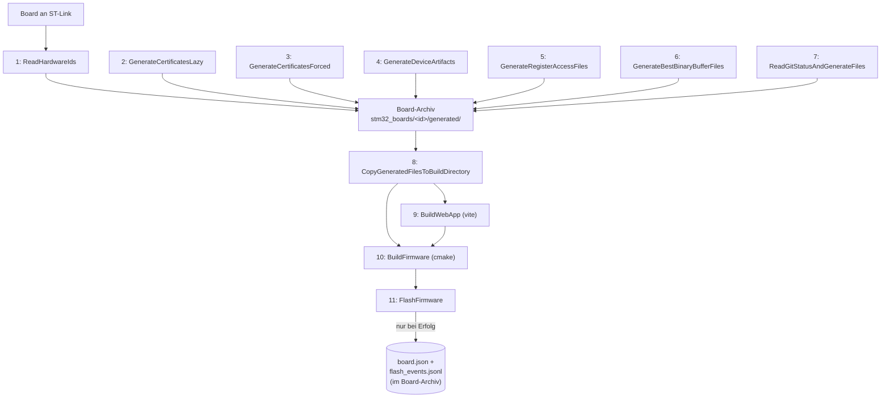

# Build-Prozess

`builder/` ist der Build-Orchestrator für den gesamten Build: Board-Identität + TLS-Zertifikat
provisionieren, Register-Map und Git-Info generieren, Web-UI bauen (Single-File, Brotli-komprimiert),
Firmware bauen (CMake) und flashen (STM32_Programmer_CLI) -- inklusive dateibasiertem Protokoll
jedes erfolgreichen Flash-Vorgangs im Board-Archiv (s. Abschnitt 6). Implementiert als
dotnet-Konsolenapplikation (C#, net10.0); lediglich
das Vite-Plugin für den Web-Build (Abschnitt 7) ist weiterhin TypeScript, da Vite keine C#-API hat --
`BuildWebApp` ruft Vite dafür per Kindprozess auf (Abschnitt 4).

## 1. Voraussetzungen

Vor dem ersten Build muessen folgende Programme installiert und im `PATH` verfuegbar sein (nach
Installation jeweils Terminal/IDE neu starten, damit ein aktualisierter `PATH` greift). Kein Punkt
davon wird vom Build-Prozess selbst geprueft oder installiert -- fehlt eines, bricht die jeweils
betroffene Phase mit einer Fehlermeldung ab (`cmake`/`ninja`/`arm-none-eabi-gcc` nicht gefunden,
`node`/`npm` nicht gefunden, `STM32_Programmer_CLI.exe` nicht gefunden).

| Programm | Gebraucht fuer | Installation |
|---|---|---|
| .NET SDK 10 | `builder/` selbst (`dotnet build`/`dotnet run`) | `winget install Microsoft.DotNet.SDK.10` |
| Node.js (inkl. npm) | `BuildWebApp` (vite) | `winget install OpenJS.NodeJS` |
| CMake | `BuildFirmware` (Configure) | `winget install Kitware.CMake` |
| Ninja | `BuildFirmware` (Generator, s. `CMakePresets.json`) | `winget install Ninja-build.Ninja` |
| GNU Arm Embedded Toolchain (`arm-none-eabi-gcc`/`g++`) | `BuildFirmware` (Cross-Compiler, s. `cmake/gcc-arm-none-eabi.cmake`) | `winget install Arm.GnuArmEmbeddedToolchain` |
| STM32CubeProgrammer | `FlashFirmware`/`pipeline:flash` (nicht fuer reine Board-Builds noetig) | Kein Winget-Paket -- Installer von [st.com/stm32cubeprog](https://www.st.com/en/development-tools/stm32cubeprog.html) (ST-Account noetig); Standardpfad passt zu `appsettings.json.template`, s. Abschnitt 8 |

`arm-none-eabi-gcc`/`STM32_Programmer_CLI.exe` haben keinen projektinternen Pfad-Override
(muessen im `PATH` liegen); Letzteres kann zusaetzlich per `STM32_PRG_PATH`-Umgebungsvariable oder
`builder/appsettings.json` auf einen abweichenden Installationsort zeigen, s. Abschnitt 8.

## 2. Kommandos

Einmalig nach dem Checkout:

```
dotnet build builder
npm install --prefix web
```

(`dotnet build` legt `builder/appsettings.json` aus der Vorlage an, falls sie fehlt, s. Abschnitt
8. `npm install` muss im `web/`-Verzeichnis laufen -- es gibt bewusst kein npm-Workspace-Root mehr
(s. Abschnitt 4); es installiert `web/`s Dependencies inkl. `vite`/`terser`/`html-minifier-terser`
nach `web/node_modules/`, wo `WebAppBuildService` sowie
`web/build-tools/vite-plugin-single-file-firmware-asset.ts` sie zur Laufzeit erwarten.)

### Gesamt-Pipelines

```
dotnet run --project builder -- pipeline:lazy   -- --preset <Debug|Release|Debug-Nucleo>   # Board-Board, kein Flash
dotnet run --project builder -- pipeline:forced -- --preset <Debug|Release|Debug-Nucleo>   # wie lazy, Zertifikat erzwungen
dotnet run --project builder -- pipeline:flash  -- --preset <Debug|Release|Debug-Nucleo>   # wie lazy, danach flashen
```

`--preset` fehlt -> Default `Debug`. `Debug-Nucleo` baut für das STM32H563ZI-Nucleo-144-Testboard
(`BOARD_NUCLEO_H563ZI`), `Debug`/`Release` für die echte Factory-Control-Unit-Platine. Fuer ein
bereits provisioniertes Board (`board.json` existiert) waehlt `CMakeLists.txt` diese Umschaltung
inzwischen automatisch (`Core/generated/board-variant.json`, s. Abschnitt 6) -- `--preset
Debug-Nucleo` bleibt als expliziter Override noetig, solange fuer dieses Board noch kein
`board.json` existiert (z. B. brandneue Platine).

Beispiel für den alltäglichen Testrig-Zyklus (Board an ST-Link, provisionieren + bauen + flashen):

```
dotnet run --project builder -- pipeline:flash -- --preset Debug-Nucleo
```

### Einzelne Phasen

```
dotnet run --project builder -- ReadHardwareIds                                # Board-ID lesen + Hardware-Snapshot schreiben
dotnet run --project builder -- GenerateCertificatesLazy                       # Zertifikat wiederverwenden/bei Bedarf erzeugen
dotnet run --project builder -- GenerateCertificatesForced                     # Zertifikat immer neu erzeugen
dotnet run --project builder -- GenerateDeviceArtifacts                        # device_ids.hh + device-ids.json + board-variant.json aus Snapshots
dotnet run --project builder -- GenerateRegisterAccessFiles          # register_map_schema/*.cs -> Code (Modbus + OPC UA + Web)
dotnet run --project builder -- GenerateBestBinaryBufferFiles                  # best_binary_buffers_schema/*.cs -> Code
dotnet run --project builder -- ReadGitStatusAndGenerateFiles                  # Git-Stand -> Code
dotnet run --project builder -- CopyGeneratedFilesToBuildDirectory             # Board-Archiv -> Core/generated, web/generated, build/assets
dotnet run --project builder -- BuildWebApp                                    # vite build
dotnet run --project builder -- BuildFirmware        -- --preset <preset>      # cmake configure + build
dotnet run --project builder -- FlashFirmware        -- --preset <preset>      # STM32_Programmer_CLI + board.json/flash_events.jsonl-Eintrag
```

Jede Phase ist einzeln sinnvoll aufrufbar, z. B. nur `GenerateRegisterAccessFiles` nach
einer Änderung an `register_map_schema/*.cs`, ohne Board oder Firmware-Build anzufassen.

### `--board` überschreiben

Alle Phasen außer `ReadHardwareIds` ermitteln das Board über einen Cache
(`build/.last-board-id`, wird von `ReadHardwareIds` geschrieben).
Um explizit für ein anderes, gerade nicht angeschlossenes Board zu arbeiten (z. B. Register-Map für
ein Archiv nachziehen):

```
dotnet run --project builder -- GenerateRegisterAccessFiles -- --board 363836_004500173434510434363836
```

## 3. Build-Phasen im Detail

| # | Phase | Braucht Hardware? | Schreibt nach |
|---|---|---|---|
| 1 | `ReadHardwareIds` | ja (ST-Link) | Board-Archiv -- liest Chip-UID, berechnet Hostname/MACs und schreibt `hardware-identity.json`. |
| 2 | `GenerateCertificatesLazy` | nein | Board-Archiv -- erzeugt/aktualisiert PEM+DER nur falls noch nicht vorhanden; schreibt `certificate-info.json`. |
| 3 | `GenerateCertificatesForced` | nein | Board-Archiv -- wie 2, aber immer neu erzeugen (CA-Rotation, Ablauf). |
| 4 | `GenerateDeviceArtifacts` | nein | Board-Archiv -- `hardware-identity.json` + `certificate-info.json` -> `device_ids.hh` + `device-ids.json` + `board-variant.json`. |
| 5 | `GenerateRegisterAccessFiles` | nein | Board-Archiv -- `register_map_schema/*.cs` -> `modbus_registers_generated.hh` + `opcua_registers_generated.hh` + `register-map.ts` (universal_register_access). |
| 6 | `GenerateBestBinaryBufferFiles` | nein | Board-Archiv -- `best_binary_buffers_schema/*.cs` (wiederholbares `--best-binary-buffer-schema-path` fuer weitere Quellen) -> `ws_protocol.hh` + `ws-protocol.ts`. |
| 7 | `ReadGitStatusAndGenerateFiles` | nein | Board-Archiv -- `gitconstants.hh`, `firmware_constants.hh` (BOARD_NAME/FW_VERSION_*, s. Abschnitt 6), `build-info.ts`, `gitstatus.json` aus Git-Abfrage + `firmware-version.json` + Board-Archiv. |
| 8 | `CopyGeneratedFilesToBuildDirectory` | nein | `Core/generated/`, `web/generated/`, `build/assets/` -- reiner Kopiervorgang aus dem Board-Archiv des zuletzt erkannten Boards. |
| 9 | `BuildWebApp` | nein | `web/dist/`, `build/assets/index.html.br` -- ruft `vite build` per Kindprozess auf (inkl. Inlining/Minify/Brotli über `singleFileFirmwareAssetPlugin`). |
| 10 | `BuildFirmware` | nein | `build/<preset>/` -- `cmake --preset` + `cmake --build --preset`. |
| 11 | `FlashFirmware` | ja (ST-Link) | `STM32_Programmer_CLI -c port=SWD -w <build>.elf -v -rst`, danach Aktualisierung von `board.json`/`flash_events.jsonl` im Board-Archiv (nur bei verifiziertem Erfolg). |



## 4. Architektur des Build-Skripts (`builder/`)

```
builder/
├── builder.csproj                   # net10.0 Console-App, Microsoft.Extensions.Configuration(.Json/.Binder)
├── Program.cs                       # Einstiegspunkt: parst argv, dispatcht auf Phasen/Pipelines
├── Paths.cs                         # zentrale Pfad-Konstanten (sucht die Repo-Wurzel ab AppContext.BaseDirectory nach oben)
├── appsettings.json                  # gitignored: persönliche Maschinenpfade (STM32CubeProgrammer, OneDrive-Ordner, CA, Default-Board-Type)
├── appsettings.json.template         # getrackte Vorlage; wird von einem MSBuild-Target (EnsureAppSettings) automatisch angelegt
├── BuilderSettings.cs                # appsettings.json gebunden an getrennte typsichere Konfigurationsklassen
└── GlobalUsings.cs                   # globale Imports auf FirmwareBuilder.Common

web/build-tools/
├── vite-plugin-single-file-firmware-asset.ts
├── singlefile-minify.ts
└── html-minifier-terser.d.ts
```

Die eigentlichen Phasen-Implementierungen (`Stm32BoardProvisioningService`, `GitBuildArtifactsService`,
`GeneratedArtifactsCopyService`, `Stm32FlashService`, `FlashFirmwarePipelineService`,
`UniversalRegisterAccessBuildService`, `BestBinaryBufferBuildService`, `CmakeFirmwareBuildService`,
`WebAppBuildService`, `BoardStateStore`, `FirmwareVersionReader` -- exakt die Namen, die `Program.cs`
in seiner `CommandPipelineRegistry` verdrahtet) leben **nicht** in diesem Repo, sondern in einem
eigenständigen Schwester-Repo `dotnet_libs/firmware_builder_common` (Projekt `FirmwareBuilder.Common`,
per `<ProjectReference>` in `builder/builder.csproj` eingebunden, analog zu `../stm32_libs` fuer die
Firmware selbst, s. Abschnitt 5) -- dieses Repo wird von mehreren Hardware-Projekten geteilt (u. a.
gibt es dort auch einen `Esp32/`-Zweig fuer ESP-IDF-Boards); die STM32-spezifischen Services liegen
darin unter `stm32/` (`Stm32BoardProvisioningService.cs`, `Stm32FlashService.cs`,
`Stm32HardwareIdentityService.cs`). Fuer den genauen Dateizuschnitt gilt das Schwester-Repo selbst
als Quelle, nicht dieses Dokument.

Ausführung ausschließlich über `dotnet run --project builder -- <Phase> [--preset ...] [--board ...]`
(bzw. nach einem einmaligen `dotnet build builder` auch direkt über die gebaute
`builder/bin/<Config>/net10.0/builder.exe`).

**`BuildWebApp` und die drei TypeScript-Dateien:** Vite hat keine C#-API, daher bleiben
`vite-plugin-single-file-firmware-asset.ts`, `singlefile-minify.ts` und `html-minifier-terser.d.ts`
bewusst TypeScript -- sie implementieren ein Vite-Plugin, das `web/vite.config.ts` einbindet
(`import { singleFileFirmwareAssetPlugin } from "./build-tools/vite-plugin-single-file-firmware-asset.ts"`).
`Program.cs` ruft dafür den zentralen Shared-Service `WebAppBuildService` auf, der intern
`node node_modules/vite/bin/vite.js build <webDir> --config web/vite.config.ts` startet
(Node/npm müssen dafür installiert sein, s. Abschnitt 1) --
Vite lädt die Plugin-Datei dabei selbst (natives TypeScript-Type-Stripping, keine
Zusatzabhängigkeit wie `ts-node`/`tsx`).

Alle fuer den Web-Build noetigen npm-Abhaengigkeiten liegen direkt in `web/package.json`
(`vite`, `html-minifier-terser`, `terser` usw.). Es gibt bewusst kein npm-Workspace-Root mehr;
Install und Build laufen ausschliesslich im `web/`-Verzeichnis.

## 5. Verzeichnisstrukturen

Repo (nur die vom Build-Prozess betroffenen Teile):

```
firmware_factory_control_unit/
├── firmware-version.json         # Produktversion (FW_VERSION_MAJOR/MINOR/PATCH), s. Abschnitt 6
├── builder/                      # s. Abschnitt 4
├── tools/                        # Skripte OHNE Bezug zur Codegenerierung (rename-usb-devices.ps1, test-modbus.ts, ...)
├── Core/
│   ├── Src/                      # kein generated/ mehr darunter
│   └── generated/                 # gitignored: device_ids.hh, gitconstants.hh, firmware_constants.hh,
│                                  # board-variant.json, modbus_registers_generated.hh,
│                                  # opcua_registers_generated.hh, ws_protocol.hh
├── web/
│   ├── src/                      # kein generated/, kein register-map.ts mehr darunter
│   └── generated/                 # gitignored: build-info.ts, register-map.ts, ws-protocol.ts
├── build/                         # komplett gitignored (CMake-Output + generierte Assets)
│   ├── .last-board-id             # "letztes bekanntes Board"-Cache, s. Abschnitt 2
│   ├── assets/                    # device_certificate.der, device_key.der, index.html.br
│   └── Debug/, Release/, Debug-Nucleo/   # je Preset ein eigener CMake-Binärordner
├── best_binary_buffers_schema/      # C#-Protokollschema (BestBinaryBuffers) + ids.txt
└── docs/
    └── build-process.md
```

Board-Archiv (`C:\Users\<user>\OneDrive - HSOS\stm32_boards\`, Pfad aus `builder/appsettings.json`,
je Maschine individuell):

```
stm32_boards/
└── <shortId>_<fullUid>\                # = boardId, s. Abschnitt 6
    ├── board.json                      # aktueller Board-Zustand, s. Abschnitt 6
    ├── flash_events.jsonl               # Flash-Historie (Append-Only-Log), s. Abschnitt 6
    ├── factory-box-<shortId>.pem.key
    ├── factory-box-<shortId>.pem.crt
    ├── factory-box-<shortId>.csr
    └── generated\                      # vollständiger Snapshot, bei jedem Lauf überschrieben
        ├── device_ids.hh
        ├── device-ids.json             # inkl. boardName (s. Abschnitt 6), von build-info.ts/firmware_constants.hh wiederverwendet
        ├── board-variant.json          # {"boardTypeName": ...} -- Default fuer CMakes BOARD_NUCLEO_H563ZI-Option, s. Abschnitt 6
        ├── device_certificate.der
        ├── device_key.der
        ├── gitconstants.hh
        ├── firmware_constants.hh       # BOARD_NAME/FW_VERSION_* (s. Abschnitt 6)
        ├── gitstatus.json
        ├── modbus_registers_generated.hh
        ├── opcua_registers_generated.hh
        ├── register-map.ts
        ├── ws_protocol.hh
        ├── ws-protocol.ts
        └── build-info.ts
```

Generierte Verzeichnisse/Dateien sind nicht eingecheckt (`Core/generated/`, `web/generated/`,
`build/` komplett -- inkl. `build/assets/*.der`, `build/assets/index.html.br` -- sowie `web/dist/`,
s. `.gitignore`). Ein frisches Checkout ist erst nach einmaligem Lauf der Build-Phasen baubar.

## 6. Board-Verwaltung (`board.json`/`flash_events.jsonl`) + Board-Type-/BOARD_NAME-Zuordnung

Dateibasiert, kein zentrales DB-File -- jedes physische Board hat sein eigenes Archivverzeichnis
`stm32_boards/<boardId>/` (`boardId` = `<shortId>_<volle96-Bit-Chip-UID>`, s. `Stm32HardwareIdentityService.ReadHardwareIds`),
darin zwei Dateien (Zugriff über `BoardStateStore.cs` im Shared-Projekt), analog zum Vorbild
`@klaus-liebler/espidf-vite` (Repo `npm-packages`, Commit "Generate everything in special
'GENERATED'-Directory", 2025-01-26 -- dort wurde eine anfangs eingesetzte SQLite-Lösung exakt
dieses Zuschnitts zugunsten von genau einem Verzeichnis pro Board verworfen; dieses Projekt hatte
dieselbe SQLite-Zwischenlösung, s. Commit f57f7f2, und zieht hier nach):

**`board.json`** -- aktueller Zustand dieses einen Boards, bei jedem erfolgreichen Flash komplett
neu geschrieben:

```json
{
  "chipUid": "004500173434510434363836",
  "hostname": "factory-box-363836",
  "mcuType": "STM32H563ZI",
  "boardTypeName": "FactoryControlUnit",
  "firstConnectedAtEpoch": 1753000000,
  "lastConnectedAtEpoch": 1753500000,
  "lastStlinkProbeSerial": "066FFF525550755187144257"
}
```

**`flash_events.jsonl`** -- ein JSON-Objekt pro Zeile, ein Eintrag pro verifiziert erfolgreichem
Flash-Vorgang (echtes Append-Only-Log: `File.AppendAllText`, kein Read-Modify-Write der ganzen
Historie bei jedem Flash):

```jsonl
{"flashedAtEpoch":1753500000,"cmakePreset":"Debug-Nucleo","gitCommitHash":"a1b2c3d","gitBranch":"master","gitIsDirty":false,"firmwareVersion":"1.2.3"}
```

Kein separater Typ-Katalog (die vormaligen `mcu_types`/`board_types`-Tabellen entfallen ersatzlos):
`mcuType`/`boardTypeName` stehen direkt als Klartext-Feld in `board.json`, ohne Fremdschlüssel --
`mcu_types` enthielt ohnehin projektweit nur den einen Eintrag `"STM32H563ZI"`,
`board_types.version` war immer `1` und `.settings` immer `NULL` (nie geschrieben). Falls künftig
eine vom angeschlossenen Board unabhängige Liste ALLER bekannten Board-Typen gebraucht wird (z. B.
für eine Auswahl-UI): das lässt sich jederzeit nachträglich per Verzeichnis-Scan über alle
`stm32_boards/*/board.json` ermitteln (Distinct auf `boardTypeName`), ohne dass `BoardStateStore.cs`
dafür etwas vorhalten muss.

**Board-Type-Zuordnung über die Chip-UID (bzw. das daraus abgeleitete `boardId`), nicht über das
Preset:** `ReadHardwareIds` (Phase 1) schlägt `boardId` in
dessen `board.json` nach (`BoardStateStore.TryGetBoardTypeName`). Existiert noch kein `board.json` (z. B.
brandneue Platine), greift `BuilderSettings.BoardDefaults.DefaultBoardTypeName` (aus `appsettings.json`, s.
Abschnitt 8) als Fallback. Das Ergebnis landet als `boardName` in `device-ids.json` sowie als
`board-variant.json` im Board-Archiv (Phase 4, `GenerateDeviceArtifacts`) und wird von dort sowohl für
`firmware_constants.hh`s `BOARD_NAME` (Phase 7, `ReadGitStatusAndGenerateFiles`) als auch beim
tatsächlichen Flashen (Phase 11, `FlashFirmware`) für `board.json`s `boardTypeName` wiederverwendet.

Das CMake-Preset spielt für diese Zuordnung selbst keine Rolle -- `BOARD_NUCLEO_H563ZI` (die
tatsächliche Pin-Belegung) wird stattdessen automatisch aus `Core/generated/board-variant.json`
vorbelegt (`CMakeLists.txt` liest dessen `boardTypeName`; `NucleoH563ZI` -> Default `ON`, sonst
`OFF`), sobald dieses Board bereits einmal erfolgreich provisioniert/geflasht wurde -- ein Mensch muss
dafuer nicht mehr von Hand das passende Preset waehlen. `option()`s Default greift dabei nur beim
ERSTEN Configure eines `build/<preset>/`-Verzeichnisses; ein expliziter Override
(`-DBOARD_NUCLEO_H563ZI=ON` bzw. das `Debug-Nucleo`-Preset ueber `cacheVariables`) gewinnt weiterhin
und ist fuer ein noch nicht provisioniertes Board (kein `board.json`, also auch kein
`board-variant.json`) weiterhin der einzige Weg. Ein einmal erfolgreich geflashtes Board behält
seinen `boardTypeName` dauerhaft, auch wenn es versehentlich mit einem anderen Preset erneut
geflasht wird -- eine Fehlklassifizierung lässt sich per direktem Edit von `board.json` korrigieren,
ohne Code anzufassen.

`BOARD_NAME` (der Anzeigename in Firmware-Log/Web-UI, z. B. `"FactoryControlUnit"`) ist damit
identisch mit `board.json`s `boardTypeName`-Wert -- kein separater, ausführlicherer Anzeigestring
mehr (den gab es früher hartkodiert samt `#ifdef BOARD_NUCLEO_H563ZI`-Umschaltung in
`Core/Inc/constants.hh`). `FW_VERSION_MAJOR/MINOR/PATCH` kommen unabhängig davon aus
`firmware-version.json` (Repo-Root, von Hand gepflegt bei einem Versions-Bump). Beide zusammen
generiert `ReadGitStatusAndGenerateFiles` (Phase 7) nach `Core/generated/firmware_constants.hh`
(von `Core/Inc/constants.hh` per `#include` eingebunden) und in `web/generated/build-info.ts`.

## 7. Web-Build-Plugin

`web/build-tools/vite-plugin-single-file-firmware-asset.ts` ersetzt die frühere Kombination aus
`vite-plugin-singlefile` + separatem Minify-Schritt + manuellem `npm run embed`: EIN Vite-Plugin,
das im selben `generateBundle`-Hook (a) JS/CSS in die `index.html` inlined (Kern angelehnt an
[`vite-plugin-singlefile`](https://github.com/richardtallent/vite-plugin-singlefile), MIT-lizenziert,
nachgebaut statt als Abhängigkeit eingebunden), (b) über `singlefile-minify.ts`
(`minifyHtmlDocument()`) Whitespace/Kommentare inkl. Lit-Templates entfernt und (c) Brotli-
komprimiert direkt nach `build/assets/index.html.br` schreibt. `BuildWebApp` (Phase 9) ist damit ein
einziger Vite-Build-Aufruf (aus `WebAppBuildService` per Kindprozess gestartet, s. Abschnitt 4)
ohne Nachbearbeitungsschritt.

## 8. Bekannte Annahmen / Hinweise

- **LAN8742-PHY-Adresse `0`** (`Core/Src/webserver.cpp`, `ETH_PHY_ADDRESS`): Standardadresse für die
  meisten STM32-Nucleo-144-Boards, nicht per CubeMX generiert. Falls für die reale
  Factory-Control-Unit-Platine falsch, liefert `HAL_ETH_ReadPHYRegister()` einen Timeout (sichtbar
  am System-Info-Panel als "PHY nicht erreichbar"), kein Hardware-Risiko.
- **`builder/appsettings.json`** enthält persönliche Maschinenpfade (STM32CubeProgrammer-Pfad,
  OneDrive-Ordner für Board-Archiv/CA) und den `DefaultBoardTypeName`-Fallback (s. Abschnitt 6) und
  ist gitignored -- getrackt ist nur `appsettings.json.template`; ein MSBuild-Target
  (`EnsureAppSettings` in `builder.csproj`) legt die reale Datei bei jedem `dotnet build`/`dotnet run`
  automatisch daraus an, falls sie fehlt, ohne eine vorhandene zu überschreiben. Gebunden an die
  typsichere `BuilderSettings`-Konfigurationsklassen über die Standard-.NET-Konfigurationsmechanik
  (`Microsoft.Extensions.Configuration`) -- `STM32_PRG_PATH` bleibt zusätzlich als dokumentierte
  Umgebungsvariable überschreibbar (s. `Stm32ProgrammerOptions.ResolveStm32ProgrammerCli()`).
