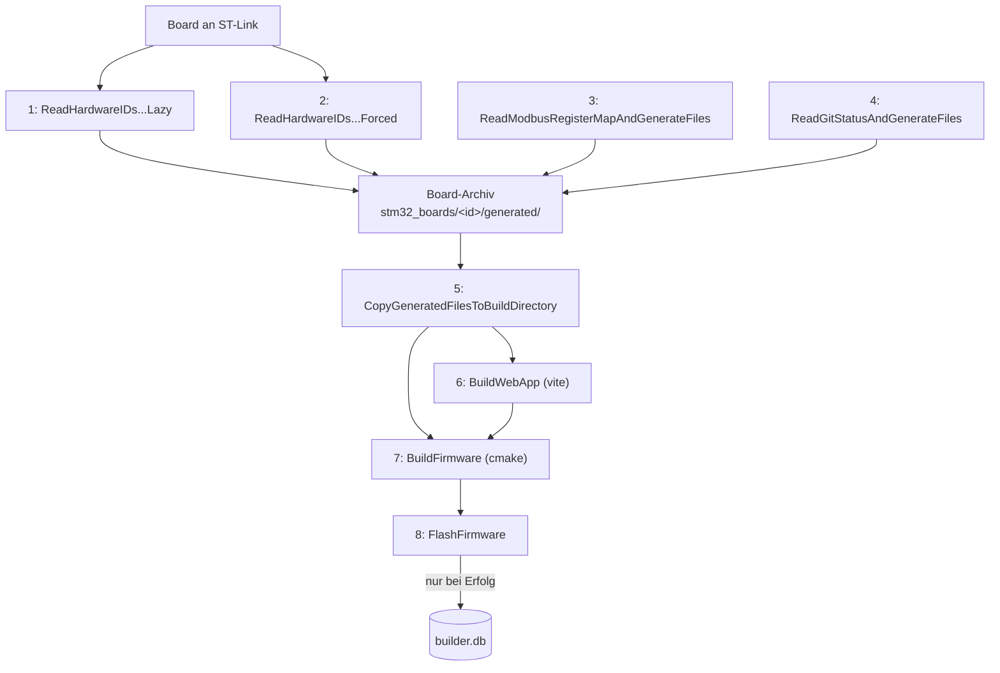

# Build-Prozess

`builder/` ist der Node/TypeScript-Orchestrator für den gesamten Build: Board-Identität +
TLS-Zertifikat provisionieren, Register-Map und Git-Info generieren, Web-UI bauen (Single-File,
Brotli-komprimiert), Firmware bauen (CMake) und flashen (STM32_Programmer_CLI) -- inklusive
SQLite-Protokoll jedes erfolgreichen Flash-Vorgangs.

## 1. Kommandos

Einmalig nach dem Checkout:

```
npm install
```

(installiert Root + `web/`-Dependencies als npm-Workspace, legt `builder/src/environment-config.ts`
aus der Vorlage an, falls sie fehlt.)

### Gesamt-Pipelines

```
npm run pipeline:lazy   -- --preset <Debug|Release|Debug-Nucleo>   # Board-Board, kein Flash
npm run pipeline:forced -- --preset <Debug|Release|Debug-Nucleo>   # wie lazy, Zertifikat erzwungen
npm run pipeline:flash  -- --preset <Debug|Release|Debug-Nucleo>   # wie lazy, danach flashen
```

`--preset` fehlt -> Default `Debug`. `Debug-Nucleo` baut für das STM32H563ZI-Nucleo-144-Testboard
(`BOARD_NUCLEO_H563ZI`), `Debug`/`Release` für die echte Factory-Control-Unit-Platine.

Beispiel für den alltäglichen Testrig-Zyklus (Board an ST-Link, provisionieren + bauen + flashen):

```
npm run pipeline:flash -- --preset Debug-Nucleo
```

### Einzelne Phasen

```
npm run phase:hardware-ids:lazy    -- --preset <preset>   # Board-ID lesen, Zertifikat wiederverwenden
npm run phase:hardware-ids:forced  -- --preset <preset>   # wie oben, Zertifikat immer neu erzeugen
npm run phase:register-map                                # register-map.json -> Code
npm run phase:git-status                                   # Git-Stand -> Code
npm run phase:copy                                          # Board-Archiv -> Core/generated, web/generated, assets
npm run phase:build-web                                     # vite build
npm run phase:build-firmware        -- --preset <preset>   # cmake configure + build
npm run phase:flash                 -- --preset <preset>   # STM32_Programmer_CLI + builder.db-Eintrag
```

Jede Phase ist einzeln sinnvoll aufrufbar, z. B. nur `phase:register-map` nach einer Änderung an
`register-map.json`, ohne Board oder Firmware-Build anzufassen.

### `--board` überschreiben

Alle Phasen außer den beiden `ReadHardwareIDs...` ermitteln das Board über einen Cache
(`build/.last-board-id`, wird von `phase:hardware-ids:lazy`/`:forced` geschrieben). Um explizit für
ein anderes, gerade nicht angeschlossenes Board zu arbeiten (z. B. Register-Map für ein Archiv
nachziehen):

```
npm run phase:register-map -- --board 363836_004500173434510434363836
```

## 2. Build-Phasen im Detail

| # | Phase | Braucht Hardware? | Schreibt nach |
|---|---|---|---|
| 1 | `ReadHardwareIDsAndGenerateFilesAndCertsLazy` | ja (ST-Link) | Board-Archiv -- liest Chip-UID, berechnet Hostname/MACs; TLS-Zertifikat nur neu erzeugen, wenn für dieses Board noch keins existiert. |
| 2 | `ReadHardwareIDsAndGenerateFilesAndCertsForced` | ja | Board-Archiv -- wie 1, Zertifikat aber immer neu erzeugt (CA-Rotation, Ablauf). |
| 3 | `ReadModbusRegisterMapAndGenerateFiles` | nein | Board-Archiv -- `register-map.json` -> `register_input.inc`/`register_holding.inc`/`register_maxindex.inc` + `register-map.ts`. |
| 4 | `ReadGitStatusAndGenerateFiles` | nein | Board-Archiv -- `gitconstants.hh`, `build-info.ts`, `gitstatus.json` aus einer gemeinsamen Git-Abfrage. |
| 5 | `CopyGeneratedFilesToBuildDirectory` | nein | `Core/generated/`, `web/generated/`, `assets/` -- reiner Kopiervorgang aus dem Board-Archiv des zuletzt erkannten Boards. |
| 6 | `BuildWebApp` | nein | `web/dist/`, `assets/index.html.br` -- ruft Vite's Build-API direkt auf (inkl. Inlining/Minify/Brotli über `singleFileFirmwareAssetPlugin`). |
| 7 | `BuildFirmware` | nein | `build/<preset>/` -- `cmake --preset` + `cmake --build --preset`. |
| 8 | `FlashFirmware` | ja (ST-Link) | `STM32_Programmer_CLI -c port=SWD -w <build>.elf -v -rst`, danach Eintrag in `builder.db` (nur bei verifiziertem Erfolg). |



## 3. Architektur des Build-Skripts (`builder/`)

```
builder/
├── singlefile-minify.ts                    # Whitespace-/Lit-Template-Minifizierung
├── html-minifier-terser.d.ts               # Ambient-Typ-Shim (html-minifier-terser liefert keine eigenen Typen)
├── vite-plugin-single-file-firmware-asset.ts  # Inlining + Minify + Brotli in einem Vite-Plugin (s. Abschnitt 7)
└── src/
    ├── cli.ts                    # Einstiegspunkt: parst argv, dispatcht auf Phasen/Pipelines
    ├── paths.ts                  # zentrale Pfad-Konstanten (Core/generated, web/generated, assets, build/)
    ├── environment-config.ts     # gitignored: persönliche Maschinenpfade (STM32CubeProgrammer, OneDrive-Ordner, CA)
    ├── environment-config.ts.template  # getrackte Vorlage dafür
    ├── board-archive.ts          # Pfade ins Board-Archiv (stm32_boards/<id>/generated/)
    ├── board-context.ts          # "Letztes bekanntes Board"-Caching (build/.last-board-id)
    ├── git-info.ts                # gemeinsame Git-Abfrage für gitconstants.hh/build-info.ts/gitstatus.json
    ├── db.ts                      # SQLite-Zugriff (builder.db), s. Abschnitt 5
    └── phases/
        ├── read-hardware-ids.ts               # Lazy + Forced (ein Modul, ein Flag)
        ├── read-modbus-register-map.ts
        ├── read-git-status.ts
        ├── copy-generated-to-build-directory.ts
        ├── build-web-app.ts                    # ruft Vite's JS-API auf (kein Kindprozess, s. Hinweis unten)
        ├── build-firmware.ts                   # ruft cmake als Kindprozess auf
        └── flash-firmware.ts                   # ruft STM32_Programmer_CLI auf + builder.db-Eintrag
```

Ausführung ausschließlich über `node builder/src/cli.ts <Phase> [--preset ...] [--board ...]`
(bzw. die `npm run phase:*`/`pipeline:*`-Kurzformen) -- Node führt die `.ts`-Dateien direkt aus
(natives TypeScript-Type-Stripping, keine Zusatzabhängigkeit wie `ts-node`/`tsx`). Relative Imports
innerhalb von `builder/` tragen deshalb die echte `.ts`-Endung (Node löst anders als `tsc`/Vite
keine `.js`-Spezifizierer auf `.ts`-Dateien auf).

`package.json` im Repo-Root ist ein npm-Workspace (`"workspaces": ["web"]`) und deklariert
`html-minifier-terser`, `terser` und `vite` zusätzlich als eigene `devDependencies` -- `builder/`
und `web/` sind Geschwisterverzeichnisse, node_modules-Resolution hebt nicht automatisch zwischen
ihnen, die Root-Dependencies stellen sicher, dass `builder/vite-plugin-single-file-firmware-asset.ts`
sie trotzdem findet (Laufzeit UND `tsc --noEmit`).

`BuildWebApp` ruft `vite`'s `build()`-API direkt im selben Prozess auf statt `npm run build` als
Kindprozess zu spawnen -- Windows' `execFileSync("npm.cmd", ...)` scheitert sonst mit `EINVAL`,
besonders wenn `builder/` schon aus einem laufenden `npm run ...` heraus aufgerufen wird.

## 4. Verzeichnisstrukturen

Repo (nur die vom Build-Prozess betroffenen Teile):

```
firmware_factory_control_unit/
├── package.json                  # Orchestrator-Skripte, npm-Workspace-Root
├── builder/                      # s. Abschnitt 3
├── tools/                        # Skripte OHNE Bezug zur Codegenerierung (rename-usb-devices.ps1, test-modbus.ts, ...)
├── Core/
│   ├── Src/                      # kein generated/ mehr darunter
│   └── generated/                 # gitignored: device_ids.hh, gitconstants.hh, register_*.inc
├── web/
│   ├── src/                      # kein generated/, kein register-map.ts mehr darunter
│   └── generated/                 # gitignored: build-info.ts, register-map.ts
├── assets/                        # device_certificate.der, device_key.der, index.html.br -- alle gitignored
└── docs/
    └── build-process.md
```

Board-Archiv (`C:\Users\mail\OneDrive - HSOS\stm32_boards\`):

```
stm32_boards/
├── builder.db                          # s. Abschnitt 5
└── <shortId>_<fullUid>\
    ├── factory-box-<shortId>.pem.key
    ├── factory-box-<shortId>.pem.crt
    ├── factory-box-<shortId>.csr
    └── generated\                      # vollständiger Snapshot, bei jedem Lauf überschrieben
        ├── device_ids.hh
        ├── device_certificate.der
        ├── device_key.der
        ├── gitconstants.hh
        ├── gitstatus.json
        ├── register_input.inc
        ├── register_holding.inc
        ├── register_maxindex.inc
        ├── register-map.ts
        └── build-info.ts
```

Generierte Verzeichnisse/Dateien sind nicht eingecheckt (`Core/generated/`, `web/generated/`,
`assets/*.der`, `assets/index.html.br`, `web/dist/` -- s. `.gitignore`). Ein frisches Checkout ist
erst nach einmaligem Lauf der Build-Phasen baubar.

## 5. Datenbankschema (`builder.db`)

SQLite-Datei unter `stm32_boards/builder.db`, Zugriff über Node's eingebautes `node:sqlite`
(lazy geladen in `db.ts`, keine Zusatzabhängigkeit -- aktuell mit `ExperimentalWarning` markiert).

```sql
CREATE TABLE mcu_types (
    id   INTEGER PRIMARY KEY AUTOINCREMENT,
    name TEXT NOT NULL UNIQUE                  -- "STM32H563ZI"
);

CREATE TABLE board_types (
    id       INTEGER PRIMARY KEY AUTOINCREMENT,
    name     TEXT NOT NULL,                     -- "FactoryControlUnit" | "Nucleo-H563ZI-TestRig"
    version  INTEGER NOT NULL,
    mcu_id   INTEGER NOT NULL REFERENCES mcu_types(id),
    settings TEXT,
    UNIQUE(name, version)
);

CREATE TABLE boards (
    chip_uid            TEXT PRIMARY KEY,        -- 24 Hex-Ziffern (96-Bit-UID)
    hostname             TEXT NOT NULL,
    mcu_type_id          INTEGER REFERENCES mcu_types(id),
    board_type_id        INTEGER REFERENCES board_types(id),
    first_connected_dt   INTEGER NOT NULL,        -- Unix-Timestamp
    last_connected_dt    INTEGER NOT NULL,
    last_stlink_probe    TEXT,                    -- ST-Link-Sondenseriennummer
    cert_issued_dt        INTEGER,
    settings              TEXT
);

CREATE TABLE flash_events (
    id                INTEGER PRIMARY KEY AUTOINCREMENT,
    chip_uid          TEXT NOT NULL REFERENCES boards(chip_uid),
    flashed_dt        INTEGER NOT NULL,
    cmake_preset      TEXT NOT NULL,              -- "Debug" | "Release" | "Debug-Nucleo"
    git_commit_hash   TEXT NOT NULL,
    git_branch        TEXT NOT NULL,
    git_is_dirty      INTEGER NOT NULL,
    firmware_version  TEXT NOT NULL               -- git::VERSION
);
```

`board_type_id` wird beim Flashen automatisch aus dem CMake-Preset abgeleitet (`Debug-Nucleo` ->
`Nucleo-H563ZI-TestRig`, sonst `FactoryControlUnit`). `flash_events` ist ein Append-Only-Log -- jeder
verifiziert erfolgreiche Flash-Vorgang erzeugt einen neuen Datensatz, `boards` hält nur den
aktuellen Zustand (`last_connected_dt` etc. wird überschrieben). Ein fehlgeschlagener Flash erzeugt
keinen `flash_events`-Eintrag.

Beispiel-Abfrage (letzte Flashs pro Board):

```sql
SELECT b.hostname, f.cmake_preset, f.firmware_version, datetime(f.flashed_dt, 'unixepoch') AS flashed_at
FROM flash_events f
JOIN boards b ON b.chip_uid = f.chip_uid
ORDER BY f.flashed_dt DESC;
```

## 6. Web-Build-Plugin

`builder/vite-plugin-single-file-firmware-asset.ts` ersetzt die frühere Kombination aus
`vite-plugin-singlefile` + separatem Minify-Schritt + manuellem `npm run embed`: EIN Vite-Plugin,
das im selben `generateBundle`-Hook (a) JS/CSS in die `index.html` inlined (Kern angelehnt an
[`vite-plugin-singlefile`](https://github.com/richardtallent/vite-plugin-singlefile), MIT-lizenziert,
nachgebaut statt als Abhängigkeit eingebunden), (b) über `singlefile-minify.ts`
(`minifyHtmlDocument()`) Whitespace/Kommentare inkl. Lit-Templates entfernt und (c) Brotli-
komprimiert direkt nach `assets/index.html.br` schreibt. `BuildWebApp` (Phase 6) ist damit ein
einziger Vite-Build-Aufruf ohne Nachbearbeitungsschritt.

## 7. Bekannte Annahmen / Hinweise

- **LAN8742-PHY-Adresse `0`** (`Core/Src/webserver.cpp`, `ETH_PHY_ADDRESS`): Standardadresse für die
  meisten STM32-Nucleo-144-Boards, nicht per CubeMX generiert. Falls für die reale
  Factory-Control-Unit-Platine falsch, liefert `HAL_ETH_ReadPHYRegister()` einen Timeout (sichtbar
  am System-Info-Panel als "PHY nicht erreichbar"), kein Hardware-Risiko.
- **`environment-config.ts`** enthält persönliche Maschinenpfade (STM32CubeProgrammer-Pfad,
  OneDrive-Ordner für Board-Archiv/CA) und ist gitignored -- getrackt ist nur
  `environment-config.ts.template`; `npm install` legt die reale Datei bei Bedarf daraus an, ohne
  eine vorhandene zu überschreiben.
- **`node:sqlite`** ist als "experimental" markiert (Node-Warnung beim ersten DB-Zugriff). Fallback
  bei Bedarf: `better-sqlite3`.
